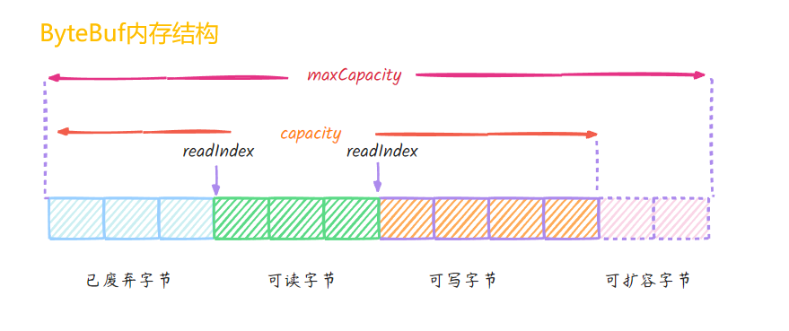

### ByteBuf
 #### 1. 创建
    ByteBuf directMemory = ByteBufAllocator.DEFAULT.buffer();
    System.out.println("directMemory = " + directMemory);
    ByteBuf heapMemory = ByteBufAllocator.DEFAULT.heapBuffer();
    System.out.println("heapMemory = " + heapMemory);

    ...output
        directMemory = PooledUnsafeHeapByteBuf(ridx: 0, widx: 0, cap: 256)
        heapMemory = PooledUnsafeDirectByteBuf(ridx: 0, widx: 0, cap: 256)

    #查看内存结构
    print ByteBufUtil.prettyHexDump(byteBuf)
    ... output 
                 +-------------------------------------------------+
             |  0  1  2  3  4  5  6  7  8  9  a  b  c  d  e  f |
    +--------+-------------------------------------------------+----------------+
    |00000000| 61 00 00 00 0a 00 00 00 14 00 00 00 1e          |a............   |
    +--------+-------------------------------------------------+----------------+
 ### 2. 池化
    #默认开启，可使用JVM启动参数调整
    -Dio.netty.allocator.type pooled/unpooled
    
    #池化优点
     - 提高创建效率
     - 合理管理内存资源 jemalloc
     - 减少内存溢出可能
### 3.内存结构
    读写指针、最大容量、有效容量(超过触发扩容)、可扩容空间

### 4.特点
 - 容量可以按需动态扩展，类似于 StringBuffer；

 - 读写采用了不同的指针，读写模式可以随意切换，不需要调用 flip 方法；

 - 通过内置的复合缓冲类型可以实现零拷贝；

 - 支持引用计数；

 - 支持缓存池。

### 5.ByteBuf 核心API
1. 数据读写
 - 读操作
   - readXxx 改变读指针
   - getXxx 不改变读指针
   - isReadable() 判断 ByteBuf 是否可读 ： writerIndex > readerIndex 可读，否则不可读
   - readableBytes() => writerIndex - readerIndex 当前可读的字节数
  - 写操作
   - writeXxx 改变写指针
   - setXxx 不改变写指针
2. 指针操作
    - markReaderIndex()  保存 readerIndex 的位置
    - resetReaderIndex()  将当前 readerIndex 重置为之前保存的位置
    - readerIndex() & writeIndex() 返回读写指针位置
3. 内存管理
    - release() & retain() 关于引用计数的操作
    - slice() 也属于特殊的数据零拷贝
      - 等同于 slice(buffer.readerIndex(), buffer.readableBytes()) 默认截取读指针到写指针之间的数据
      - 最大容量 maxCapacity 为原始 ByteBuf 的可读取字节数
      - 底层分配的内存、引用计数都与原始的 ByteBuf 共享
      - !! 如果写入数据，会影响原始ByteBuf底层数据
    - duplicate()
      - 截取的是整个原始 ByteBuf 信息
      - 底层分配的内存、引用计数也是共享
      - !! 如果写入数据，会影响原始ByteBuf底层数据
    - copy()
      - 从原始ByteBuf中拷贝信息，数据都是独立的
      - 写入数据不会影响原始ByteBuf
### 6.内存管理相关设计 jemalloc
